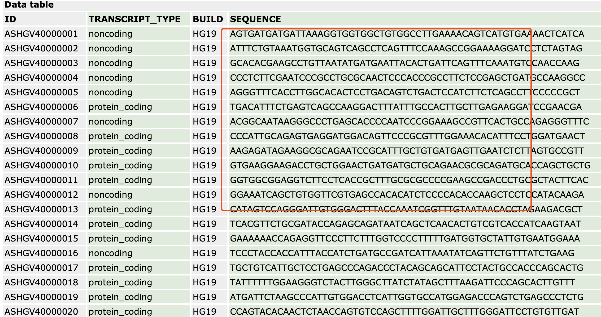
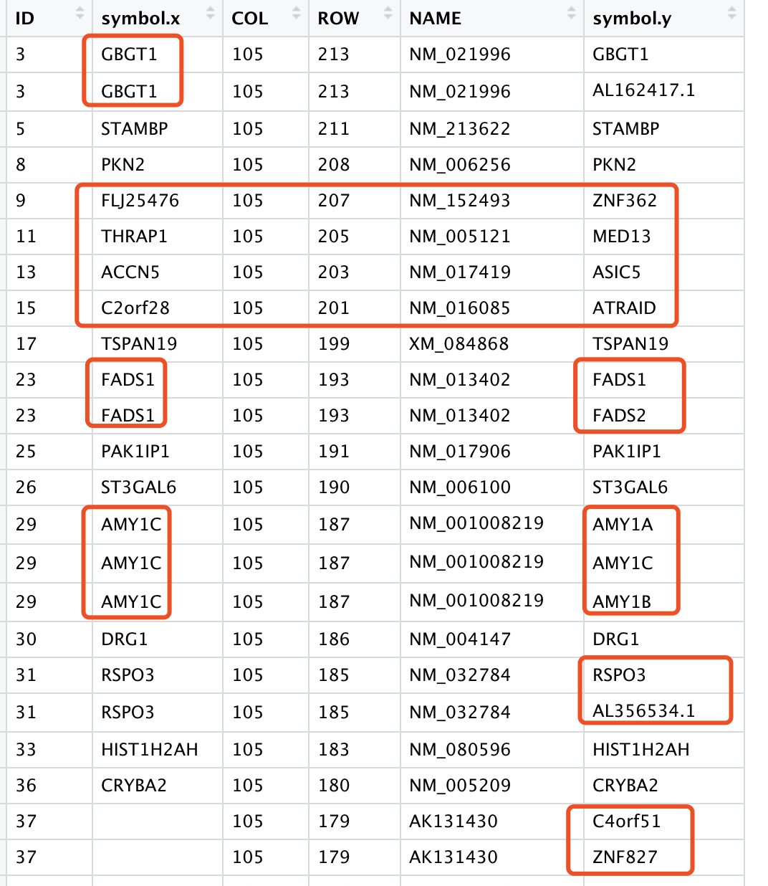
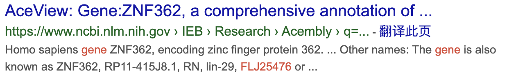

# 下载全部表达芯片平台的探针的碱基序列自主注释到基因ID

郑重申明：此包idmap3存放在GitHub，仅仅是一个草稿，不会再维护，也不会更新，是为了说明我最后的annoprobe包的开发历程。

前面我们提到过表达芯片探针注释的3种方法，参见：[第一个万能芯片探针ID注释平台R包](https://mp.weixin.qq.com/s/CzV9zv0AbhhfTalVomTGCw), 并且帮助大家搞定了第一种bioconductor包的方法，大家**无需下载几十个bioconductor包**，然后自己一个个提取基因信息，我全部为大家做好啦，也就是 **idmap1** 这个目前host在GitHub， R包：

- https://github.com/jmzeng1314/idmap1

但是第一个包只能是解决有bioconductor包的那些芯片平台，毕竟是少数，所以我又开发了第二个万能芯片探针ID注释平台包，参见：[第二个万能芯片探针ID注释平台R包](https://mp.weixin.qq.com/s/B_e8TbOim5jBKYLxvdZM3w) , 把全部表达芯片的soft文件下载好后，提前它们的芯片和基因symbol对应关系并存储好，最后是 **idmap2** 这个目前也host在GitHub， R包：

- https://github.com/jmzeng1314/idmap2

### 大量的GPL平台的soft文件并不提供基因注释新

比如：https://www.ncbi.nlm.nih.gov/geo/query/acc.cgi?acc=GPL21827

能拿到的信息就探针序列，所以是idmap1和idmap2都是无法注释的，这个时候就需要我们的idmap3啦！



我下载了全部提供探针碱基序列的GPL平台，然后批量比对到其对应的参考基因组，比如human,mouse,rat ，然后注释到其最新版gtf文件，获取探针比对到参考基因组坐标后注释到的基因信息。

### 安装我的idmap3包

idmap1解决了bioconductor包下载困难的问题，idmap2解决了GPL平台的soft文件下载困难，而这个idmap3解决了那些并不提供探针的注释信息的平台。

```r
library(devtools)
install_github("jmzeng1314/idmap3")
library(idmap3)
```

因为有40M，所以下载安装会比较慢哦，喝杯咖啡吧！也欢迎**赞助我一杯咖啡**，我们一起喝！

#### 关于GitHub下载困难

在中国大陆，大部分人访问GitHub还是很困难的，如果你确实无法下载， 就需要下载我的微云版本：

然后参考我以前的教程：[安装GitHub的R包困难解决方案](https://mp.weixin.qq.com/s/fqQ9iDBl_IKpyVFtIUwOPg) 

### 使用idmap3

比如如果想获取Agilent-079487 Arraystar Human LncRNA microarray V4 (Probe Name version)的注释信息，一行代码就搞定！它的平台是：GPL21827

```
library(idmap3)
ids=idmap3::get_pipe_IDs('GPL21827')
head(ids) 
```

这个平台，GPL21827，Agilent-079487 Arraystar Human LncRNA microarray V4 因为在GEO里面仅仅是提供了探针序列，所以我们前面的两个R包都无能为力，只能这个idmap3哦！

你想知道我们支持哪些平台吗，当然是可以看的：

```
data(gpl_list)
gpl_list[,1:4]
```

希望你的平台，在我们的列表，能帮助你进行芯片注释。

### 比较soft文件自带的注释信息和我们的流程注释

```r
rm(list = ls())
options(stringsAsFactors = F)
library(idmap2)
library(idmap3)
# Agilent-011521 Human 1A Microarray G4110A  (Feature Number version)   GPL885
ids2=get_soft_IDs('GPL885')
ids3=get_pipe_IDs('GPL885')
tmp=merge(ids2,ids3,by.x='ID',by.y='probe_id')
table(tmp$symbol.x==tmp$symbol.y)

length(unique(tmp[,1]))
length(unique(tmp[tmp$symbol.x==tmp$symbol.y,1]))
length(unique(tmp[tmp$symbol.x!=tmp$symbol.y,1]))

data("gpl_list")
gpl_list[,1:2]

```

可以看到很多有趣的问题：



其实很多探针，会同步注释在一个lncRNA和一个mRNA上面，因为lncRNA和mRNA坐标是有交叉的。

**而且soft文件自带的注释信息的基因名字都太陈旧了。**



```
An 800 kb deletion at 17q23.2 including the MED13 (THRAP1) gene, revealed by aCGH in a patient with a SMC 17p.

Name:ATRAID. Synonyms:APR3, C2orf28.

Complete information for ASIC5 gene (Protein Coding), Acid Sensing Ion Channel Subunit Family Member ... Previous HGNC Symbols for ASIC5 Gene. 
```

### 是不是需要更新你的注释啦

那么，赶快使用我们的包吧！

#### 文末友情宣传

强烈建议你推荐给身边的**博士后以及年轻生物学PI**，多一点数据认知，让他们的科研上一个台阶：

- [全国巡讲全球听（买一得五）](https://mp.weixin.qq.com/s/sgmSCK4GuAY0-bPDua34cg) ，你的生物信息学入门课
- [生信技能树的2019年终总结](https://mp.weixin.qq.com/s/azTBe54kv3OpS16hrSKzQQ)  ，你的生物信息学成长宝藏
- [2020学习主旋律，B站74小时免费教学视频为你领路](https://mp.weixin.qq.com/s/Y-8YKye2jOw2tSLJnCvBlA)

